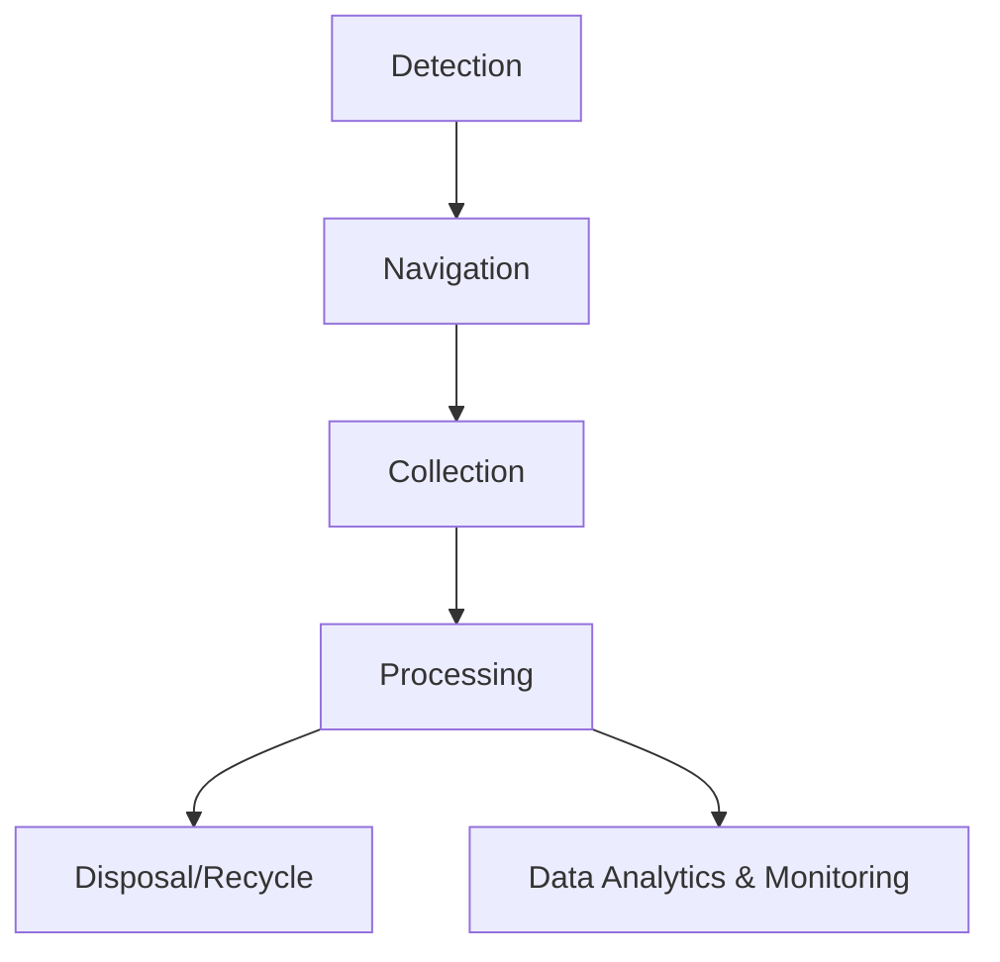

# Hydroclear Technologies

## Brief Introduction

32 aquatic organisms die every second, with 1,32,000 marine animals dying annually due to ocean pollution (NOAA, WWF). Global warming, rising sea levels, and increased CO2 levels exacerbate marine pollution. Despite increased awareness, no cost-effective, scalable solutions exist for removing oceanic plastic waste efficiently.

Hydroclear Technologies aims to innovate scalable drone technology to automate ocean plastic cleanup, addressing this critical environmental challenge. Our mission is to empower Earth's water with innovation, ensuring a sustainable future for marine ecosystems.

---

## Workflow Diagram

The workflow demonstrates the end-to-end process of plastic waste cleanup, starting from detection to proper disposal or recycling. The integration of data analytics ensures continuous improvement in efficiency and targeted cleanup operations.

---

## Concept Map

1. **Problem Identification**

   - Marine pollution statistics.
   - Impact of plastic on aquatic life.

2. **Solution Development**

   - Scalable and cost-effective drone technology.
   - AI-driven navigation and plastic detection.

3. **Implementation**

   - Integration of renewable energy sources.
   - Advanced sensors and high-resolution cameras.

4. **Sustainability Focus**

   - Contribution to UN SDG 14: Life Below Water.
   - Global collaboration for cleanup initiatives.

5. **Impact Measurement**
   - Data-driven insights on pollution reduction.
   - Community awareness and engagement metrics.

---

## Tech Stack

### Software

- **Programming Languages**: Python, C++ for AI and navigation algorithms.
- **AI Algorithms**: TensorFlow and OpenCV for real-time object detection.
- **Control Systems**: ROS (Robot Operating System) for seamless integration of drone components.
- **Data Analytics Tools**: Tableau and Power BI for monitoring and reporting.

### Hardware

- **Microcontrollers**: Raspberry Pi v2 and Arduino.
- **Sensors**: Ultrasonic, LIDAR, and high-resolution cameras.
- **Propulsion Systems**: Energy-efficient motors with waterproof casing.
- **Power Source**: Solar panels and rechargeable batteries.

---

## Novelty

### Existing Solutions and Drawbacks

1. **The Ocean Cleanup**

   - High operational costs.
   - Limited deep-sea reach.
   - Dependency on external funding.

2. **Seabin Project**

   - Limited to calm waters.
   - Frequent maintenance requirements.
   - Small collection capacity.

3. **FRED (Floating Robot for Eliminating Debris)**
   - Surface-only collection.
   - High power and maintenance needs.
   - Weather-sensitive.

### Unique Features of Hydroclear

- **AI-Driven Navigation**: Real-time algorithms for efficient plastic detection and navigation.
- **Cost-Effective Operations**: Renewable energy sources minimize operational costs.
- **High Scalability**: Designed for both coastal and deep-sea operations.
- **Comprehensive Data Analytics**: Provides actionable insights for targeted cleanups.
- **Global Collaboration**: Enables integration with worldwide networks for shared environmental goals.

---

## Solution

Aqua Guardian, an advanced cleanup drone, integrates software and hardware capabilities for:

- **Plastic Detection**: AI algorithms for precise identification.
- **Data Analysis**: High-resolution monitoring for targeted cleanups.
- **Efficient Navigation**: Optimized for varying oceanic conditions.
- **Cost-Effective Operations**: Leveraging renewable energy to reduce expenses.
- **Community Engagement**: Promoting public awareness and participation.

---

## Others

### Business Model

#### B2B

- **Governments & Agencies**: Long-term contracts for cleanup operations.
- **NGOs & Corporations**: Drone packages, training services, and collaborative CSR projects.

#### B2C

- **Eco-Conscious Consumers**: Donations, merchandise sales, and mission subscriptions.

### Traction

- **Sustainable Development Goal Alignment**: Focused on SDG 14 - Life Below Water.
- **Patent Potential**: Strong innovation foundation for intellectual property.
- **Academic Recognition**: Aimed for publication in leading journals and conferences.
- **Startup Viability**: Scalable design supports future business development.

### Marketing Strategy

- **Impact Messaging**: Highlighting measurable environmental benefits.
- **Digital Campaigns**: Social media outreach and virtual demonstrations.
- **Public Engagement**: Workshops, educational programs, and cleanup events.
- **Strategic Partnerships**: Collaborating with environmental organizations and policymakers.

---

## What’s Next?

1. **Patent Acquisition**: Secure intellectual property rights for the Aqua Guardian.
2. **Pilot Projects**: Launch in targeted polluted regions for proof of concept.
3. **Global Expansion**: Scale operations to address marine pollution worldwide.
4. **Continuous Innovation**: Incorporate advanced AI models and hardware upgrades.
5. **Community Involvement**: Foster partnerships with local communities and schools to enhance awareness and participation.

---

**Presented by:**  
Sarvesh PV (Software & Control Systems)  
Balaganesh S (ML & Hardware Integration)  
Armaan Ahmed I (Mechanical Design & Hardware Integration)
